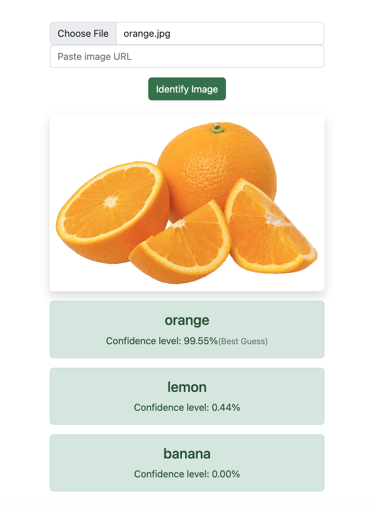

# ImageSense
## An Image Classification App using Next.js and TensorFlow.js
### Description

ImageSense is a web application that allows you to perform image classification using the TensorFlow.js library. The application is built with Next.js and provides an intuitive user interface for uploading and classifying images.

#### Screenshot of the app in action
<!--  -->
<p align="center">
  
</p>

#### Check out the live app:
[ImageSense](https://image-sense.herokuapp.com/)

### Installation

To install and run the application, follow these steps:

1. Clone the repository:
 
```
git clone https://github.com/TylerGeorgeAlexander/ImageSense.git
```

2. Navigate to the project directory:

```
cd ImageSense
```

3. Install the dependencies using npm:

```
npm install
```

### Usage

Once the installation is complete, you can start the application by running the following command:
```
npm run dev
```
This command starts the development server and opens the application in your default web browser. You can then access the application at http://localhost:3000.

### Configuration

By default, the application uses a pre-trained model for image classification. 

Be sure to set up a .env.local for local test environments using the .env.example
```
MONGODB_URI=your_mongodb_uri_here

CLOUDINARY_CLOUD_NAME=your_cloudinary_cloud_name_here
CLOUDINARY_API_KEY=your_cloudinary_api_key_here
CLOUDINARY_API_SECRET=your_cloudinary_api_secret_here
```

### Contributing

If you'd like to contribute to this project, please follow these guidelines:

    Fork the repository on GitHub.
    Create a new branch with a descriptive name for your feature or bug fix.
    Commit your changes and push the branch to your fork.
    Submit a pull request to the main repository.

Please ensure your code adheres to the project's coding conventions and includes appropriate tests.

### License

This project is licensed under the MIT License. Feel free to use, modify, and distribute the code as per the terms of the license.

### Acknowledgments

We would like to acknowledge the TensorFlow.js library and the Next.js community for their valuable contributions to the project.

### Contact

If you have any questions, suggestions, or issues, please contact us at TylerGeorgeAlexander.dev@gmail.com.